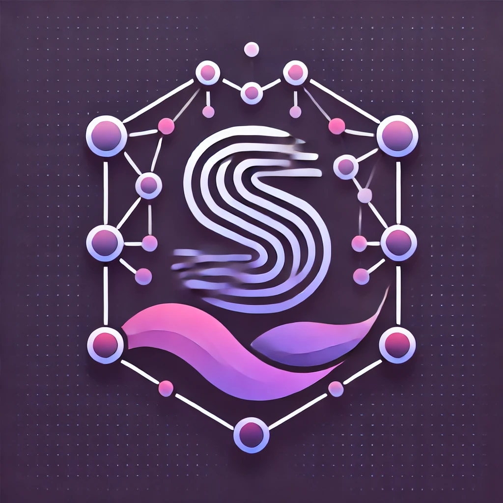

# Heimdall



Heimdall, a Solid Stream Analytics Service, can be used on top of one or multiple Solid Pods and constructs a materialized view on top of the stream measurements stored in the Solid Pod. Heimdall currently functions under the assumption that the Solid Pod uses the [LDES in LDP](https://woutslabbinck.github.io/LDESinLDP/) specification to store the stream measurements. The aggregated results are sent to the client requesting the data, and the materialized view is published to Heimdall's Solid Pod for further reuse by other clients and processes with similar aggregated-result requirements.

## Requirements 

- One or Multiple Solid Pods which use the [LDES in LDP](https://woutslabbinck.github.io/LDESinLDP/) specification to store the stream measurements.
- The sensor events should be stored in the Solid Pod in the form of an LDES stream and a file containing the sensor events in RDF can be replayed to the Solid Pod with the help of [LDES in Solid Semantic Observation Replayer](https://github.com/argahsuknesib/LDES-in-SOLID-Semantic-Observations-Replay) library.
- A sample of the sensor events which can be replayed is available [here](https://github.com/argahsuknesib/dahcc-heartrate).

## Configuration of the Solid Pod

- We are under the assumption that the client queries the Solid Pod using Heimdall, but the client does not know the location of the LDES stream by default.
We employ [Type Indexes](https://solid.github.io/type-indexes/) to store the location of one or more LDES streams. When querying the Solid Pod, Heimdall first queries the Type Index to get the location of the LDES stream and then retrieves the LDES stream to get the sensor events.

## Installation

- Clone the repository
- Install the dependencies using `npm install`
- Start Heimdall's Solid Pod with the command
```bash
npm run start-solid-server
``` 
The command will start a Solid Server on the port 3000 with a Solid Pod named `aggregation_pod` which can be accessed at `http://localhost:3000/aggregation_pod/`. The aggregation results are stored in Heimdall's Solid Pod in the form of an LDES stream using the [LDES in LDP](https://woutslabbinck.github.io/LDESinLDP/) specification.
- Create a folder and a file named `logs/aggregation.log` in the root directory of the project. Heimdall stores its logs in this file.
- Now, start Heimdall with the command
```bash
npm run start aggregation 
```
The command will start Heimdall on port 8080. Heimdall exposes both an HTTP server and a WebSocket server on port 8080 where the client can send a request for aggregated results from a Solid Pod.

- The protocol to communicate with Heimdall is by sending a RSP-QL query to the service.
```ts
let message = {
    // The query to be sent to Heimdall (RSP-QL query)
    query: `INSERT YOUR QUERY HERE`,
    // The type of mointoring query can be either, `historical+live` or `live`
    type: `INSERT YOUR TYPE HERE`
}
```
and send this message object to Heimdall using the WebSocket connection.

## Tests

The tests for Heimdall are written using the Jest framework. Coverage is not yet 100%.

## Linting

You run the linter via 
```shell
npm run lint:ts
```

You can automatically fix some issues via
```shell
npm run lint:ts:fix
```

## License

This code is copyrighted by [Ghent University - imec](https://www.ugent.be/ea/idlab/en) and released under the [MIT Licence](./LICENCE) 

## Contact

For any questions, please contact [Kush](mailto:kushagrasingh.bisen@ugent.be) or create an issue in the repository [here](https://github.com/SolidLabResearch/solid-stream-aggregator/issues) .
